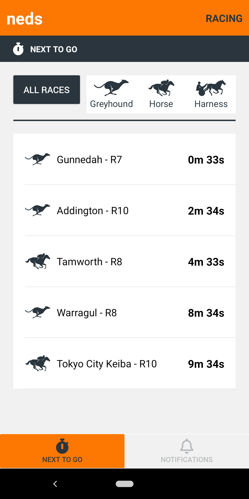

# Neds Mobile
Mobile implementation of Neds "Next to go" screen. 
Created for Entain's front-end developer challenge. This application
was implemented using React Native.

## Getting Started

Before running the application, please ensure that you have installed the following in your machine. 
Please note that this application has been tested in *android* devices only. 

- [NodeJS](https://nodejs.org/en/) - used to run the app
- [Android Studio](https://developer.android.com/studio/install) - used to run emulators. Optional if you can connect your Android phone in debug mode.
- [Android Debugger Bridge](https://developer.android.com/studio/command-line/adb) - used to find connected android devices

### Step 1: Ensure an android phone is connected
If you have the android debugger bridge installed, please run `adb devices` to check attached devices. Output would look like this:

```
List of devices attached
89KX0AYM2       device
```

### Step 2: Start the app
```
cd neds-mobile
npm install
npm run android
```

## Process

### Step 1: Analyse requirements and data
- Used [Postman](https://www.postman.com/) to analyse data structure
- Looked at neds.com.au for design expectations
- Asked recruiter questions

### Step 2: Gather resources
This step involved gathering resources needed to create an app that's consistent with brand.
- Scraped the SVG assets from the neds website
- Identified colour palette

### Step 3: Design user interface to identify best layout
Went through four iterations of UI design. Can find all design iterations here in this [Figma link](https://www.figma.com/file/Eey6aMcAsluOKIt7HzKjCR/Entain?node-id=0%3A1)

### Step 4: Set up development environment
- Set up project linting, prettier, and babel-config so my code is clean
- Created ErrorBoundary for smoother handling of errors and crashes
- Created AppProvider as a wrapper for all third party modules
- Installed native-base so components can be easily positioned on screen

### Step 5: Implement the view
The focus here is to implement all the components.
- Implemented a few reusable components whenever possible
- Used mock data for components

### Step 6: Integrate with backend and redux
- Used redux toolkit to set up my store, slices, etc.
- Implemented fetch logic using axios
- Used redux thunk to create asynchronous calls
- Used intervals to manage when data will be retrieved from backend (if a race happened 1 minute ago), 
  and each race details manage their own display time.

### Step 7: User testing
- Got family to play around with the app to see if flow is natural

### Step 8: Write docs
- This is what I'm doing now.

## Future Improvements
- More pages. At the moment, I added a placeholder navigation to support more screens. If more screens to be added,
- Remove logic for filtering out data after the fetch in the mapper. All filtering logic should be in the backend.
  Front-end should really just pass in a parameter.
- Add automated testing through jest and react-testing-library 

## App Screenshot


